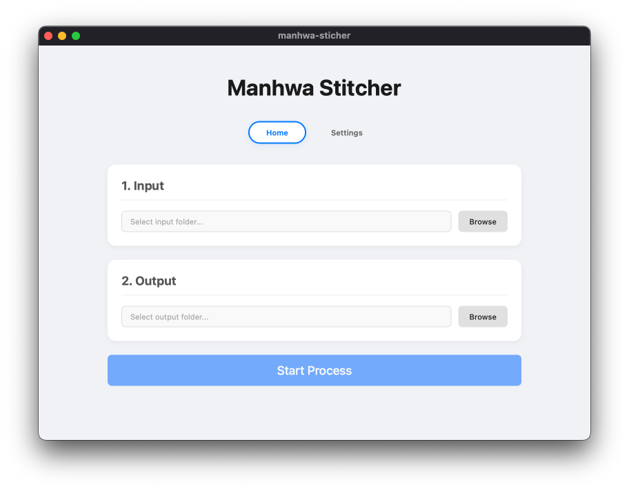
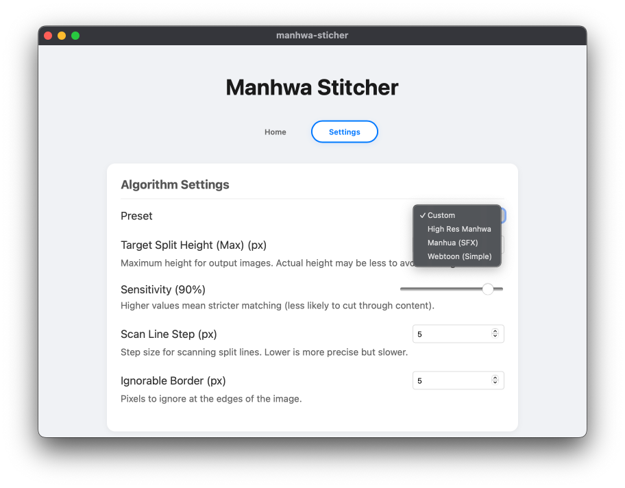

# 📚 Manhwa Sticher

**Manhwa Sticher** là ứng dụng desktop giúp **cắt ảnh manhwa (webtoon)** dài thành nhiều trang nhỏ **mà không bị mất thông tin**, tối ưu hóa cho người sáng tạo và người đọc.

Ứng dụng được xây dựng bằng **Tauri v2**, **SvelteKit** và **Rust**, tận dụng hiệu năng của Rust cho việc xử lý ảnh.

## 🚀 Tính năng nổi bật

  * ✂️ **Tự động cắt ảnh**: Chuyển ảnh manhwa cuộn dài thành các trang đọc mà không bị mất SFX, thoại.
  * 🎯 **SmartStitch**: Thuật toán chôm từ nhiều nơi giúp **phát hiện điểm cắt tối ưu** (tránh cắt ngang nội dung quan trọng).
  * 🖼️ **Xử lý Batch**: Cắt nhiều ảnh cùng lúc.
  * ⚙️ **Giao diện thân thiện**: Giao diện tab, Preset thuật toán, quản lý file đầu ra dễ dàng.

## 📸 Giao diện




## 💾 Download:

[https://github.com/jhin1m/manhwa-sticher/release](https://github.com/jhin1m/manhwa-sticher/release)

## 🛠️ Yêu cầu hệ thống (Development)

Để phát triển dự án, bạn cần:

  * **Node.js** \>= 18.0
  * **pnpm** \>= 9.0
  * **Rust** \>= 1.70
  * **Platform-specific dependencies** (Ví dụ: `libwebkit2gtk-4.1-dev` trên Linux).

> **Chi tiết Dependency Linux:**
>
> ```bash
> # Ví dụ cho Ubuntu/Debian
> sudo apt-get install -y libwebkit2gtk-4.1-dev libappindicator3-dev librsvg2-dev patchelf
> ```

## 👨‍💻 Development

1.  **Clone repository:**
    ```bash
    git clone https://github.com/jhin1m/manhwa-sticher.git
    cd manhwa-sticher
    ```
2.  **Cài đặt Dependencies:**
    ```bash
    pnpm install
    ```
3.  **Chạy Development Mode:**
    ```bash
    pnpm tauri dev
    ```
    (Lệnh này sẽ tự động khởi động frontend (Vite) và backend (Rust) với hot-reload).

-----

## 📦 Build Production

Sử dụng lệnh sau để build ứng dụng cho platform hiện tại:

```bash
pnpm tauri build
```

Artifacts sẽ nằm trong thư mục `src-tauri/target/release/bundle/`.

> Project sử dụng **GitHub Actions** để tự động build và release cho Windows/macOS/Linux

## 📜 Cấu trúc & Kiến trúc

  * **Frontend**: SvelteKit + Svelte 5 (SPA, Vite).
  * **Backend**: Rust + Tauri v2.
  * **Communication**: Frontend gọi Rust commands qua `@tauri-apps/api/core`.
  * **Image Processing**: Sử dụng crate `image` trong Rust.

## 📝 License & Đóng góp

  * **License**: MIT.
  * **Contributing**: Rất hoan nghênh Pull Requests\! Vui lòng tạo Issue trước cho các feature lớn.

## 📮 Liên hệ

  * GitHub: [@jhin1m](https://github.com/jhin1m)

-----

Bạn muốn tôi tóm tắt thêm về một phần cụ thể nào đó (ví dụ: quy trình Release) không?